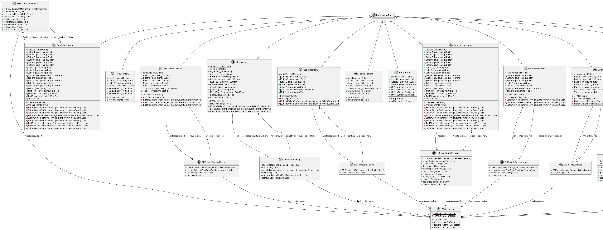
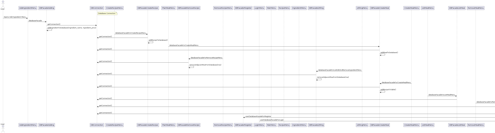
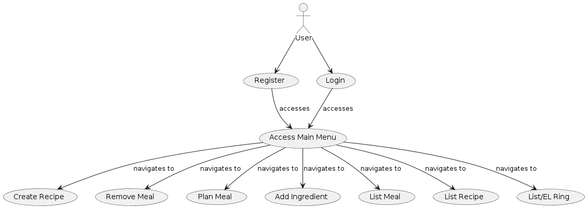

# eclipse-java-maven-template

# Overview

## Recipe Cost Calculator Application With GUI


## Releases

- [](https://github.com/ucoruh/eclipse-java-maven-template/releases/latest)

## Platforms

- 

- 

- 

## Test Coverage

[](https://github.com/ucoruh/eclipse-java-maven-template/actions/workflows/release.yml)

**Coverage**

- 

**Branch Coverage**

- 

**Line Coverage**

- 

**Method Coverage**

- 


### You can acces the project uml diagram from below 





### Sequence Diagram 



### Usecase Diagram



### Install Requirements

- Eclipse
  
  - [Eclipse Downloads | The Eclipse Foundation](https://www.eclipse.org/downloads/)

- Maven
  
  - [Maven – Download Apache Maven](https://maven.apache.org/download.cgi)

- JDK
  
  - [Eclipse Downloads | The Eclipse Foundation](https://www.eclipse.org/downloads/)

- Lcov
  
  - https://fredgrott.medium.com/lcov-on-windows-7c58dda07080

- Coverxygen
  
  - [coverxygen · PyPI](https://pypi.org/project/coverxygen/)
  
  - [GitHub - psycofdj/coverxygen: Generate doxygen&#39;s documentation coverage report](https://github.com/psycofdj/coverxygen)

- Reportgenerator
  
  - https://reportgenerator.io/

```bash
dotnet tool install -g dotnet-reportgenerator-globaltool
```

- Choose Licence
  
  - [Appendix | Choose a License](https://choosealicense.com/appendix/)
